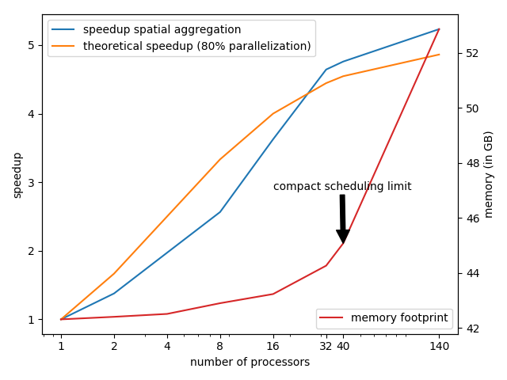
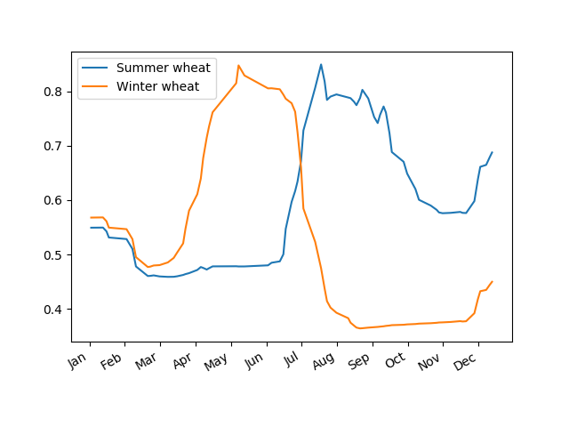

# JRC Monitoring of agriculture parcels with optical EO data

With the new Common Agriculture Policy (CAP)14implementation, there has been an important shift  from  a  controlling  approach  based  on  sampling  to  monitoring  each  agricultural  parcel. Satellite imagery from the Copernicus programme are now available with a spatial resolution of up to 10 m (Sentinel-1 and Sentinel-2) that allow to extract sufficiently detailed information at the average parcel level. Meanwhile, with the two-satellite constellation (A and B), revisit times of 2-3 days can be obtained at mid-latitudes.  Even for the cloudy conditions in most part of central and western Europe this allows to obtain time series to characterise the phenology of different crop types along the agronomic year for each agricultural parcel.

Most importantly, with the free, full and open data policy adopted for the Copernicus programme, these data have become available to all users without restrictions.  However, the amount of data to process can be an obstacle for European Union (EU) member states that will implement the new CAP monitoring system.  With an efficient extraction tool that aggregates the pixel information at the parcel level, this task can be greatly simplified.  Instead of dealing with massive amounts of pixel data of varying quality (e.g., due to cloud cover), member states obtain spatially aggregated and filtered time series that can be analysed locally.

## description
The process graph for this use case is relatively simple, using only five basic processes and asingle UDF process:

With respect to the standard implementation of the core API, a new geometry file type in aggregate_spatial was added (in addition to geoJSON). The large number of polygons for this use case (238.428) would result in a large geographical JSON file, whereas the file is already present on disk within the processing environment.  Two additional arguments are passed via the context argument  of  the  process  aggregate_spatial.   The  first  is  a  negative buffer to exclude the border pixels for each polygon.  The second is srcnodata to ignore all pixels in the  polygons  that  have  been  masked  by  the  mask  process  for  the  calculation  of  the  mean aggregation.

The user defined function (UDF) is based on code that makes use of the [pyjeo](https://doi.org/10.3390/ijgi8100461) module. It performs a data smoothing to fill in gaps due to cloudy observations and a subsequent Savitzky-Golay filter, following the approach outlined in [J. Chen 2004](https://doi.org/10.1016/j.rse.2004.03.014). Until pyjeo will be released under the open source license (GPLv3), back-ends can use the Savitzky-Golay filter from [SciPy](https://docs.scipy.org/doc/scipy/reference/generated/scipy.signal.savgol_filter.html), or apply the [process graph without udf](data/zonal_statistics_timeseries_ndvi_noudf.json).

* [deliverable 26](https://owncloud.tuwien.ac.at/index.php/s/j1rFjSsv1W4XyXx?path=%2FopenEO_Public%2F05_Deliverables%2FD26_FinalUseCaseProcessChains#pdfviewer)

## process graph

[process graph with udf](data/zonal_statistics_timeseries_ndvi_udf.json)
[process graph without udf](data/zonal_statistics_timeseries_ndvi_noudf.json)
## datasets
### Sentinel-2 data at level-2A
[list of products in JSON format](data/sentinel2.json)

### parcels
[input vector file](data/BRP_Gewaspercelen_2017.sqlite)

## result

Extracted parcels:

[results with udf](data/jrc_usecase5_result_udf.json)
[results without udf](data/jrc_usecase5_result_noudf.json)

Speedup (multi-threading)

filtered NDVI profile of Winter and Summer wheat

profile of Winter wheat with and without UDF

